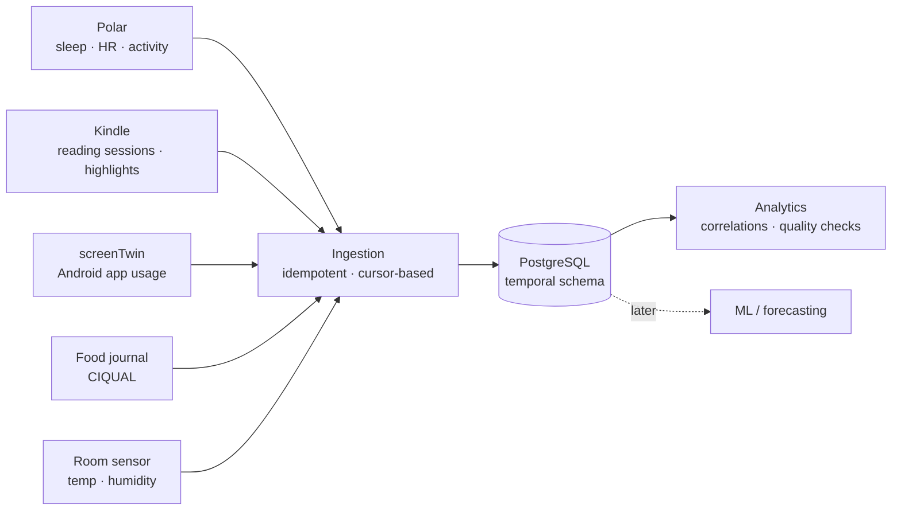

# Ernest

**Building my way into AI Engineering.** Wallonia, Belgium.

I don't learn from tutorials. I pick a problem I actually have, build the whole
thing (sensor, data, model, backend, interface), and publish it, including the
parts that turned out to be harder than expected.

Currently training as an **AI & IoT Architect** at Technofutur TIC.

---

### The thing I care about most right now

**Data is perishable, and almost nobody treats it that way.**

Polar deletes your activity data after ~28 days. The Kindle writes your reading
sessions to a rotating buffer, uploads them to Amazon, then erases them. Android
keeps detailed app usage for a short window and then aggregates it away.

Every one of those is a stream that exists *right now* and will be gone forever
if nothing is listening. So I built something that listens.

The design constraint that shaped everything: **a new source must not require a
schema migration.** So the schema is organised by the *temporal shape* of the
data, not by where it came from. A heartbeat and a meal's calories are both
points in time, so they live in the same table with a different `source_id`. A
night of sleep and a workout are both intervals. Your weight is a slowly
changing state.

It has been verified twice: adding the food journal and the room sensor changed
neither the models nor the repository layer. Zero lines.

Turns out this is the same problem industrial data historians solve. Heterogeneous
sources, perishable time series, idempotent ingestion, schema that has to survive
the sources you haven't thought of yet. That's the work I want to do.

---

### What I'm building

| Project | What it is |
|---|---|
| **Personal data platform** | The one above. PostgreSQL on Docker, OAuth2 collection, 3 sources, 66 metrics, 7 tables, 4 views. Collectors are independent and know nothing about the database. |
| **screenTwin** | Android screen-time tracking and app blocking. Native Kotlin module, because the blocker has to work when the JS engine isn't alive. Feeds the platform. |
| **kindle-tracker** | Reverse-engineered the Kindle's own SQLite databases to recover reading sessions before the firmware deletes them. Feeds the platform. |
| **swissKNIFE** | A local file converter. 36 converters, type detection by signature instead of extension, target-size search by bisection. No AI, no network, fully deterministic. |
| **TaskForge** | Task manager with XP, streaks and focus sessions. Next.js, PostgreSQL, Drizzle, integration tests. |
| **AIoT Energy Monitor** | In progress. Sensor to MQTT to time-series storage to anomaly detection to dashboard. The one that ties the training together. |

---

### Stack

---

### Learning in public

[**Learning-IOT-AI-Architect**](https://github.com/AwesomeBoat/Learning-IOT-AI-Architect)
is the open logbook of my training. Every exercise and note, clean or rough,
one commit at a time. 30 modules, from algorithmics to an AI + IoT capstone.

---

### A few things I believe about building

- **A README that only says how to install it is half a README.** Say what the
  thing does, what it refuses to do, and which decision you'd make differently.
- **Write down why you rejected the alternative.** Six months later that's the
  only note you'll actually need.
- **The interesting constraint is usually the boring one.** `minSdkVersion 26`,
  a rotating buffer, a 28-day retention window. That's where the architecture
  actually gets decided.
- **Collect first, analyse later.** You can always run a better model on old
  data. You can never run any model on data you didn't keep.

---

📫 Reach me on [LinkedIn](https://www.linkedin.com/) or open an issue on any repo.
